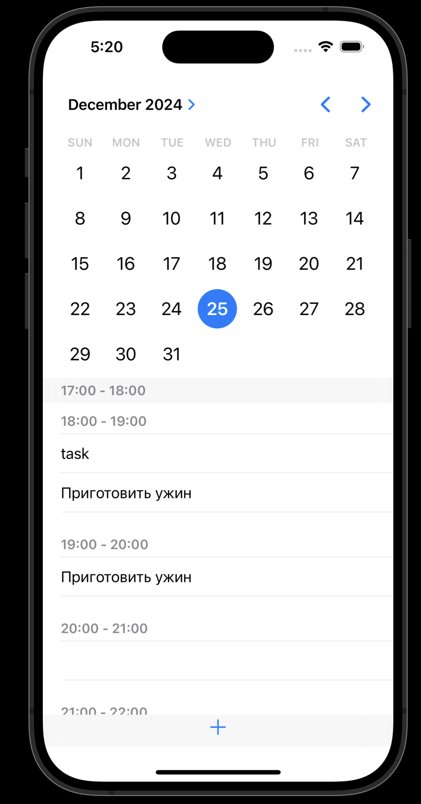
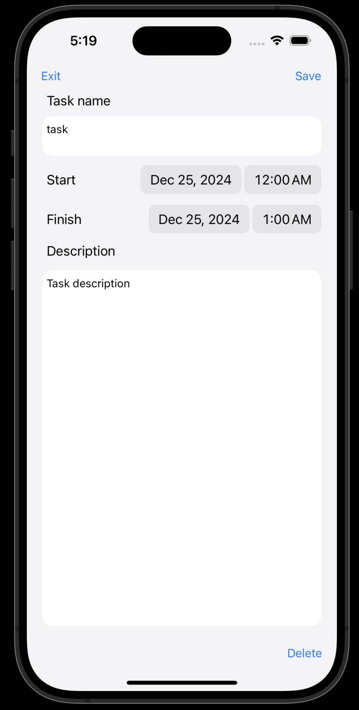

# DIARY

Diary - мобильное приложение для возможности управления ежедневными делами. 

## Функционал 

<table>
  <tr>
    <td>
      
    </td>
    <td>
      
    </td>
  </tr>
</table>

  
- создание задачи
- удаление задачи
- редактирование задачи
- локальное хранение задачи

**В приложении присутствуют 2 экрана:**

1 экран: отображение списка задач за один день
- календарь, в котором пользователь может выбрать дату
- таблица, отображающая дело на 1 час
- внутри таблицы ячейка с названием дела

2 экран:
- ячейки, для записи или просмотра данных: название, дата старта, дата окончания, описание задачи

### Создание задачи

- Для создания задачи пользователю необходимо нажать кнопку "+", после чего указать название, дату начала, дату окончания и описание, после этого нажать кнопку "save"

### Удаление задачи

- для удаления необходимо выбрать задучу в таблице, после этого нажать кнопку "delete"

### Редактирование задачи

- для редактирования задачи необходимо выбрать задачу и вписать новые данные, после этого нажать кнопку "save"

### Локальное хранение

- для локального храния использован Realm
- в проекте используется JSON для первоначальной реализации базы данных при первичном запуске приложения

### Верстка 
- верстка приложения осуществляется с помощью UIKit
- ориентация: портретная

### Тестирование

- тесты написаны для части взаимодействия с данными, т.е сервисного слоя
- в тестах используется библиотека XCTest

### Архитектурные паттерны

- в приложении использован паттерн проектирования Singleton
- приложение построено на реализации паттерна MVVM

## View

- View находится в папке View и представляет реализацию двух экранов
- `ViewController` - основной экран отображения календаря и списка задач
- `TaskController` - дополнительный экран отображения описания задачи, также используется для создания и редактирования

## Model

- Model находится в папке Model
- `TaskModel` - класс для хранения данных
- `TaskService` - класс для взаимодействия с данными

## ViewModel

- `ViewModel` - класс для взаимодействия view и model

<!-- internship.mobile@simbirsoft.com. -->